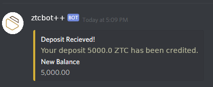
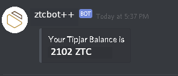

## Registering your Wallet

Go to the `#bots` channel in the [Discord Server](https://discordapp.com/invite/9s7jWXF), and type `.registerwallet Ze...`, and replace `Ze...` with your wallet address.

For example, you would type

```
.registerwallet Ze4tc4mTG137cG3i5oa8yLAW4iZvPoRVsEx5dGRhiEcoEWEVCBvc4hB6fcDyqE2FoWPpLWnGGswq19yqsFi1bhDd1XnDmtD6T
```

## Depositing Zent Cash

After your wallet address has been registered, type `.deposit` in the `#bots` channel, then:

* Check for a new direct message from TIPBOT
* Copy the line of code he gives (excluding the `Integrated Address:`) and enter that as the address of the recipient  

**No Payment ID!**

#### zentwallet

Follow the steps given [here](wallets/Using-Zentwallet#sending-zent-cash-transactions) and replace the values of the address with the one provided.

- See [Expected Results](#expected-results) section below

### Expected Results

When the bot receives the payment, it will send you a PM letting you know. Now you can tip people!

 

## Checking your Balance

Before you can tip, you need to know your balance. Your balance is the amount of ZTC you have in your tipjar wallet to tip to others.

To check your balance, type `.balance`. TIPBOT will PM you with how much balance you have remaining in your tipjar wallet.



If it shows `0.00`, then make sure you have [deposited](#depositing-zent-cash) some ZTC and it has [been received](#expected-results)

## Tipping People
To tip someone, type `.tip 12345 @person`.

Replace `12345` with how much you want to tip the person.  
Replace `@person` with whom you want to tip it to.

For example, `.tip 1 @ViktorZ` will tip the user called "ViktorZ"  1 ZTC.

* The minimum you can send is 0.01 ZTC, and the bot will take an extra 0.1 ZTC on top of what you tipped to account for fees  
So if you tipped 1 ZTC, 1.1 ZTC will be pulled from your account so that the full 1 ZTC reaches the recipient*

### Adding a Message when Tipping

***The syntax for tipping someone is- `.tip 12345 @person`***

- Trying to add a message before it, will not work.  
 For example,
 ```
 hey .tip 1 @ViktorZ#0294
 ```

 will **not** send ViktorZ 1 ZTC.

 ---

- Trying to add it on a separate line in 1 message will not work.  
 For example,
 ```
 heyo there.
 I'm tipping you

 .tip 1 @ViktorZ#0294
 ```

 will **not** send ViktorZ 1 ZTC.

 ---

- Trying to add a message *after* it will **will** work.  
 For example,
 ```
 .tip 1 @ViktorZ#0294 hey
 ```

 **will** send ViktorZ 1 ZTC

 ---

- Trying to add a message after the command on a separate line in an existing message **will** work.  
 For example,
 ```
 .tip 1 @ViktorZ#0294

 hey
 ```
 **will** send ViktorZ 1 ZTC.

 ---

- Trying to add a message *between* the *amount* and the *recipient* **will** work.  
 For example,
 ```
 .tip  1 hey @ViktorZ#0294
 ```
 **will** send ViktorZ 1 ZTC.

 ---

- If you make a typo in the command, and try to edit the message to fix the typo, it will **not** work.

**Basically, keep these in mind-**  

* Any text must go **after** the command
  - It may also go in **between** the **amount** and **recipient**
* Trying to **edit** the command will *not* work


### Tipping with Emojis

Reacting with the emoji  on someone's message will tip them 99 ZTC.

If someone has tipped someone, then reacting with  on the message on which they tipped the person (`.tip 1 @ViktorZ#0294`) will send the recipient (in this case, ViktorZ) the same amount he was originally tipped (in this case, 1).    
So the recipient (ViktorZ) gets 2 ZTC.

Reacting with  on a message where in a person was tipping with the emoji  will **not** tip the original poster of the message 99 ZTC.  
You *can* react with the emoji  (again) however, to tip the person 99 ZTC.

### Tipping Multiple People

The syntax for tipping multiple people is- `.tip 1 <@person1 @person2>`

For example, `.tip 1 @ViktorZ#0294 @k4rl0s#6290`

This will tip ViktorZ *and* bebop 1 ZTC **each** (it will not divide the 1 ZTC in between the 2).

The bot will still pull a fee of 0.1 ZTC extra from your balance.

This can be used to tip - so far - an unlimited amount of people, given that you have enough balance.  
The bot will PM you after it has sent the payments to everyone, letting you know the TX Hash, your updated balance, and how many people it sent it to, along with the number of 

- successful payments (the recipient had registered their wallet and the payment was successfully sent)  
- unsuccessful payments (the recipient had not registered their wallet and/or the payment was not successfully sent)

If you tip multiple people, some who have registered their wallets and some who haven't, the bot will react with  and :sos: for both(only once).  
However, it will not let you know whose wallet has not been registered, simply the amount of people it did send it to (so you can deduce the number of people it was not able to send to by subtracting the number of successful payments from the number of people you tipped).

*Sadly, trying to tip "Roles" (like `@dev-zentcash`, `@everyone`, `@here` etc) and expecting the bot to automatically tip everyone with that said role won't work, as it has not been programmed to do so* :(

### Where Do These Tips Go?

When you tip someone, the desired amount plus 0.1 ZTC is pulled from your tipjar wallet balance and sent to the recipient's registered wallet (if he has not registered a wallet, he cannot receive tips).

When you get tipped, the sender sends the desired amount plus 0.1 ZTC, pulled from his tipjar wallet balance, directly to your registered wallet (if you haven't registered a wallet, you can't receive tips).  
It also reacts to the message on which the person was tipped (`.tip 1 @ViktorZ#0294`) with .

It *does not* send the ZTC to your tipjar balance. It sends it *directly* to your **wallet**.  

However, you can redirect tips that you receive from others with `.redirecttips` to have tips go directly to your tip balance (you still have to have registered a wallet however)

- If you try to tip someone who isn't registered, the bot will react with :sos: and PM them with instructions on how to register their wallet and tip.

## Other Commands

TIPBOT isn't just a tip bot, it's so much more! Here's a table of it's other commands, what each of them do, and how to use them (which aren't explained above).

| Name | Usage |  Description |
|:-:|:-:|:-:|
| hashrate | `.hashrate` | Returns current network hashrate. |
| height | `.height` | Returns current blockchain height. |
| difficulty | `.difficulty` | Returns current network difficulty. |
| supply | `.supply` | Returns current circulating supply. |
| faucet |  `.faucet` | Returns information about current amount of ZTC in the faucet's wallet. |
| updatewallet | `.updatewallet Ze...` | Updates your currently registered wallet address in case of a change(is not a replacement for `.registerwallet Ze...` ). |
| wallet | `.wallet @<user>` | PM's you with the wallet address of the user tagged(`.wallet @k4rl0s#6290`). If you type only `.wallet` it will PM you with your own wallet address. |
| redirecttips | `.redirecttips` | Toggles between sending tips to your registered wallet and keeping them in your tipjar |
| marketcap | `.mcap` | Returns current Market Cap. Cannot be used in the main Zent Cash Discord, only in the [Market one](https://discordapp.com/invite/9s7jWXF). |
| price | `.price` | Returns current price. Cannot be used in the main Zent Cash Discord, only in the [Market one](https://discordapp.com/invite/9s7jWXF). |


That's it! Enjoy tipping and getting tipped :)
