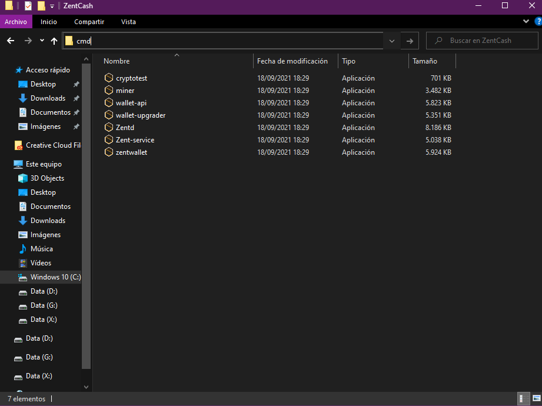
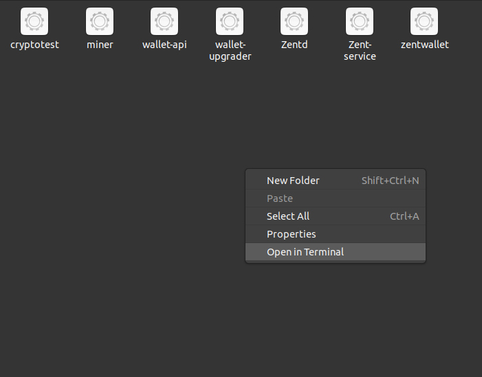

Solo mining Zent Cash means that you, alone, try to find the next block.  
**It is extremely hard, and not recommended** - try our [other guides](Mining) if you want a more steady flow of ZTC.  
Solo mining is limited to *only your CPU*.

If you're sure you want to solo mine, let's continue.

## Setup and Running

Make sure you have  `Zentd` and `miner`, both can be found in [the latest release](https://github.com/ZentCashFoundation/Zent/releases).    

*Note*: If they aren't there, you'll have to compile it yourself:

* [Windows](https://github.com/ZentCashFoundation/Zent#windows)
* [Linux](https://github.com/ZentCashFoundation/Zent#linux)
* [OSX](https://github.com/ZentCashFoundation/Zent#osxapple-using-clang)

Ensure **`Zentd` is running and fully synced**.

Go to your folder that has `miner.exe` in it and start a cmd prompt.  

- This can easily be done by moving to the `Zentd` directory in Windows Explorer, then typing `cmd` in the search bar and hitting enter:



In Linux, you may be able to right click on your directory and "Open in" Terminal



When it opens, type:  
`miner --address Ze.. --threads 4 --scan-time 1 --log-level 3`

Repace `Ze..` with your Zent Cash public address.  
We recommend setting the `--threads` option to half of how many you have. So if you have 12 threads in your CPU, set it to `6`.  

Example:  
```bash
miner --address  Ze4tc4mTG137cG3i5oa8yLAW4iZvPoRVsEx5dGRhiEcoEWEVCBvc4hB6fcDyqE2FoWPpLWnGGswq19yqsFi1bhDd1XnDmtD6T --threads 4 --scan-time 1 --log-level 3
```

Congratulations, you are now solo mining Zent Cash from your CPU.

#### Notes

* `Zentd` *must* stay running for the miner to mine Zent Cash.  
* Be patient. Finding a block may happen within the first few hours of mining. It also may take a week. Or it may never happen.  
* If you accidently close out `Zentd` you can restart the miner by hitting Ctrl+C on your keyboard, then re-entering the miner command given above.  
* You may have to adjust the amount of threads based on your PC's capabilities(half of how many your CPU has is recommended).
