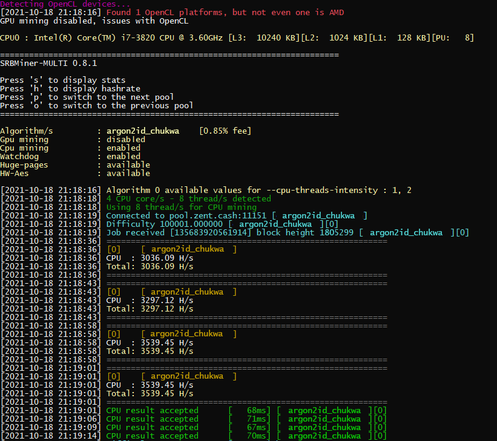

## Downloading and Installing for Windows or Linux

SRBMiner can be downloaded from the [GitHub page.](https://github.com/doktor83/SRBMiner-Multi/releases/tag/0.7.5)

## SRBMiner Setup and Configuration

1. Unzip the file and extract the files into a new folder (Make sure your anti-virus doesn't delete the files)
2. Edit the batch file named "start-mining-zentcash.bat".
3. Find and change the following lines:

* `--pool pool.zent...` keep the `-pool` but replace the address with a pool of your choice. You can learn more about them [here](Pools).
* `--wallet Ze...` keep the `-wallet` but replace the one in the file with your own Zent Cash address.

4.  Save the file and
  * start `start-mining-zentcash.bat` for Windows
  *  or `./start-mining-zentcash.sh` for Linux

That's it! You should be mining away now! :)

## Troubleshooting
Most issues are usually because of out-of-date GPU drivers, if the miner doesnt work or cannot detect your GPU, try updating to the latest drivers!

* Older GPU cards in Linux - Sometimes with older AMD cards the miners will not detect the GPU. You can try reinstalling the drivers with `sudo ./amdgpu-pro-install --opencl=legacy -y`  
