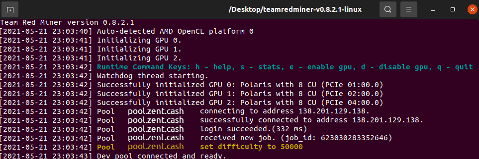

## Downloading and Installing for Windows or Linux

Team Red Miner can be downloaded from the [GitHub page.](https://github.com/todxx/teamredminer/releases)

## Team Red Miner Setup and Configuration

1. Unzip the file and extract the files into a new folder (Make sure your anti-virus doesn't delete the files)
2. Edit the batch file named "start_ztc_chukwa.bat".
3. Find and change the following lines:

* `-o stratum+tcp://pool.zent...` keep the `-o` but replace the address with a pool of your choice. You can learn more about them [here](Pools).
* `-u Ze...` keep the `-u` but replace the one in the file with your own Zent Cash address.

4.  Save the file and
  * start `start_ztc_chukwa.bat` for Windows
  *  or `./start_ztc_chukwa.sh` for Linux

That's it! You should be mining away now! :)

## Troubleshooting
Most issues are usually because of out-of-date GPU drivers, if the miner doesnt work or cannot detect your GPU, try updating to the latest drivers!

* Older GPU cards in Linux - Sometimes with older AMD cards the miners will not detect the GPU. You can try reinstalling the drivers with `sudo ./amdgpu-pro-install --opencl=legacy -y`  
