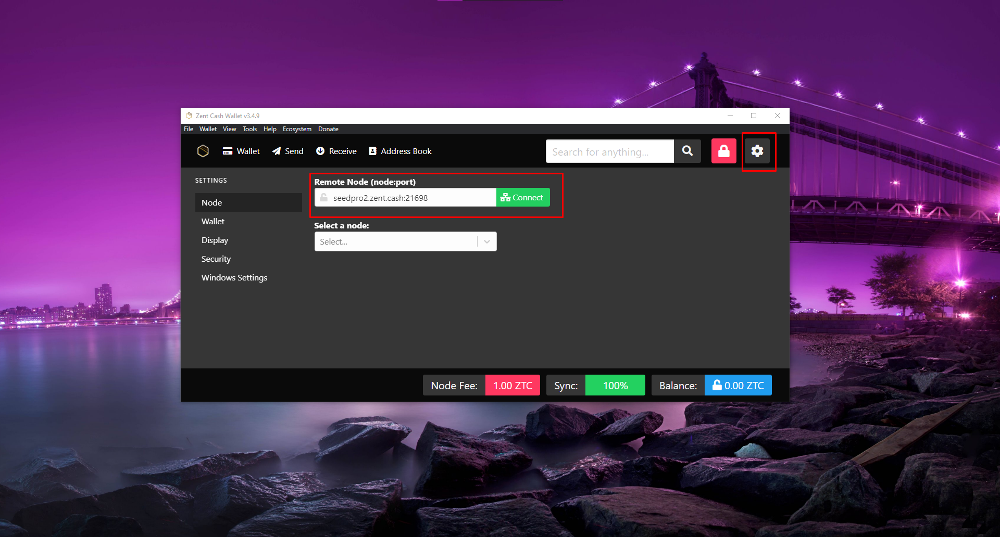

# Using Remote Nodes

In case you don't want to download the blockchain and verify it everytime, you can instead use a Remote Node to quickly sync the blockchain.

## Zent Cash Wallet

**Note:** By default, Zent Cash Wallet connects to a reliable remote node over SSL, so this step should be unnecessary unless you wish to connect to a particular remote node.

1. Open your wallet
2. Click on the settings icon in the top right
3. In the text box below, enter the URL and Port of the node you wish to connect to
4. Click "Connect"

- You may also click "Find node..." which will select a random node



## Zentwallet

1. Open up a command prompt window and navigate to the folder that contains *zentwallet*.
2. Use the following command to start zentwallet  

### Windows:

```
zentwallet.exe --remote-daemon host:port
```

### Mac and Linux

```
./zentwallet --remote-daemon host:port
```

Replace `host:port` with values from one of the public remote daemons available below.

You can now follow your normal process to access your wallet.

For example:

```
zentwallet.exe --remote-daemon seedpro1.zent.cash:21698
```

### Making a Script to Do it Automatically

*Note*: This only works on Windows, and for zentwallet

1. Open NotePad/a text editor of your choice and type the following lines inside:

```text
@echo off
zentwallet.exe --remote-daemon host:port
pause
```

1. Replace `host:port` with the values from a node in the given links below.
2. Save the filename as `start.bat` and save the file as `All files`.
3. Double click on the file to start the daemon.

## Known remote daemons

https://github.com/ZentCashFoundation/zentcash-nodes-json
